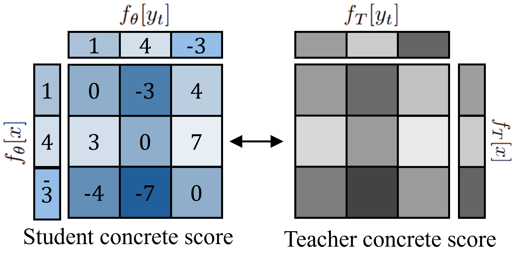
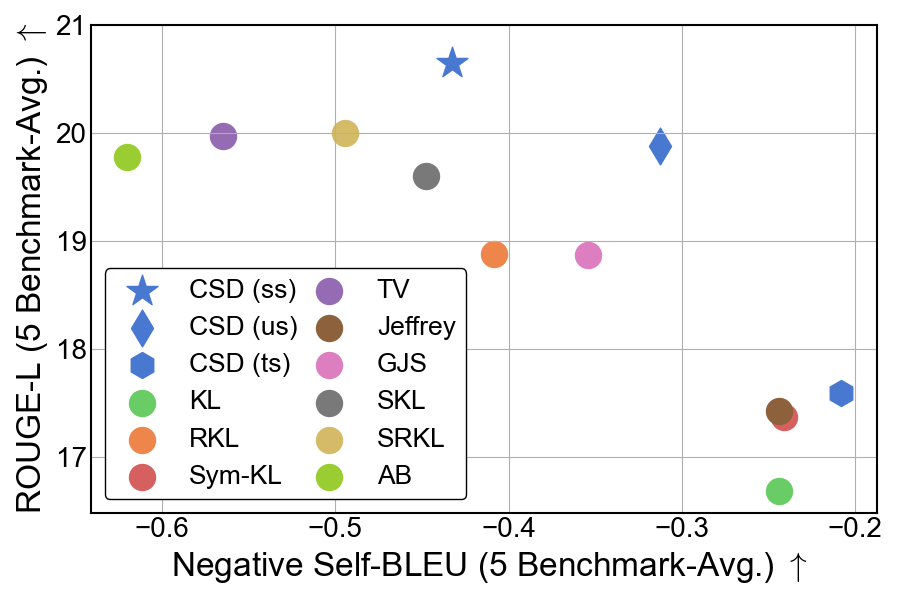

# Distillation of Large Language Models via Concrete Score Matching [ICLR 2026]
### Official PyTorch implementation of CSD

[Yeongmin Kim](https://sites.google.com/view/yeongmin-space/) , [Donghyeok Shin](https://sdh0818.github.io/), [Mina Kang](https://aai.kaist.ac.kr/bbs/board.php?bo_table=sub2_1&wr_id=25) , [Byeonghu Na](https://sites.google.com/view/byeonghu-na), and [Il-Chul Moon](https://aai.kaist.ac.kr/)   

| [Openreview](https://openreview.net/forum?id=bZBJFrxH1H) | [arxiv](https://arxiv.org/abs/2509.25837)| 

---
<table>
  <tr>
    <td width="58%" valign="top" align="center">
      <br>
      <em>Method — CSD matches the concrete score, i.e. the matrix of pairwise logit residuals <code>f[x] - f[y_t]</code>, between student and teacher.</em>
    </td>
    <td width="42%" valign="top" align="center">
      <br>
      <em>Trade-off — (w1, w2) gives CSD a lever to control the fidelity–diversity trade-off.</em>
    </td>
  </tr>
</table>

---

## Overview
**TL;DR**: This paper performs distillation between two autoregressive language models via score matching, thereby defining the loss directly at the logit level.

Knowledge distillation (KD) compresses a large teacher LLM into a smaller student, and most objectives do so by matching **per-token probabilities** after softmax (KL, reverse-KL, f-divergences, and smoothed variants). We instead work directly at the **logit level**: because softmax is invariant to an additive constant, noticeably different logit vectors (e.g. `[-1, -4, 4]` vs `[1, -9, 6]`) can map to nearly identical probabilities, so part of the teacher's logit information is lost in probability space — an effect amplified in large-vocabulary LLMs where most tokens carry near-zero probability.

Direct Logit Distillation (DLD) matches logits with an MSE loss, but its exact-match condition ignores this *logit shift invariance* (teacher and student need only agree up to a constant), which constrains its solution set.

**Concrete Score Distillation (CSD)** is a logit-level objective that addresses both points in one framework:

- **Operates directly on logits**, complementing probability-space objectives.
- **Respects logit shift invariance** — its optimal solution set is a superset of DLD's.
- **Linear-time** in vocabulary size despite a pairwise formulation.
- **A design space with arbitrary positive weighting** — flexible weighting functions `(w1, w2)` recover both mode-seeking and mode-covering instances and allow tuning along the fidelity–diversity trade-off.

We evaluate CSD on task-agnostic instruction following, task-specific distillation (summarization / translation / math), and general chat, across backbones up to 7B (GPT-2, OpenLLaMA, Gemma, Qwen2.5, Gemma2).

---

## Method

CSD matches the **relative differences between every pair of vocabulary logits** between student and teacher (illustrated in the schematic above), rather than matching logits one-to-one (as in DLD) or matching softmax probabilities (as in KL-family objectives).

For a logit vector $f$, the concrete score of token $y_t$ against token $x$ is the (log) probability ratio, which on the logit side is simply the **residual** $f[x] - f[y_t]$. CSD aligns this residual matrix between student and teacher, giving the loss:

$$
\mathcal{L}_{\mathrm{CSD}}(\theta) = \frac{1}{2} \sum_{y_t \in \mathcal{V}} \sum_{x \in \mathcal{V}} w(y_t, x) \left( f_\theta[x] - f_\theta[y_t] - f_T[x] + f_T[y_t] \right)^2
$$

This lets the student compare itself **against the teacher** while also performing relative comparisons **among its own vocabulary items**. The weighting function $w(y_t, x)$ makes the pairwise relationships explicit and adjustable.

**Why the log / residual form?** Matching the raw probability ratio $q(x)/q(y_t)$ can be numerically unstable when the denominator is small. Applying a logarithm turns the ratio into a difference of logits, yielding a stable MSE and a clean logit-level formulation.

---

## Fidelity–Diversity Trade-off

A practical feature of CSD is that its two weighting functions provide a **lever on the fidelity–diversity trade-off** (shown in the plot above). Probability-matching objectives tend to occupy characteristic points on this trade-off — for instance, forward KL is mode-covering while reverse-KL is mode-seeking. CSD lets you move along the trade-off by choosing the weighting source — Teacher (`T`), Uniform (`U`), or detached Student (`S`):

| Weighting `(w1, w2)` | Behavior | Notes |
|----------------------|----------|-------|
| `(S, S)` *(default)* | Mode-seeking | Highest fidelity (ROUGE-L) in our experiments; concentrates on regions the student already favors |
| `(U, S)`             | Balanced     | Learns minority vocabulary more evenly; well-balanced trade-off, useful under high-temperature sampling |
| `(T, S)`             | Mode-covering| More diversity and better probability calibration; a good default for small-data or harder optimization settings |

The trade-off is set by the loss weighting and can be further adjusted with decoding temperature at inference time.

---

## Results (summary)

- **Task-agnostic instruction following** (GPT-2-1.5B → GPT-2-0.1B): CSD attains the highest average ROUGE-L among the compared objectives in our setup.
- **Compatibility with on-policy methods:** CSD integrates with ImitKD / GKD / DistiLLM and improves results in each setting, and scales to OpenLLaMA-7B → 3B.
- **Task-specific** (Gemma-7B-IT → Gemma-2B-IT): strong results across summarization, translation, and GSM8K under a shared setup.
- **General chat** (Qwen2.5-7B-IT → 1.5B, Gemma2-9B-IT → 2B): competitive performance on MT-Bench and AlpacaEval.

Please see the paper for full tables, baselines, and experimental details.

### Reproducing each result

**[`task_agnostic_distillation/`](task_agnostic_distillation)**

| Paper | Experiment | Reproduction script |
|---|---|---|
| Table 1 | CSD (GPT-2) | `scripts/gpt2/kd_CSD/csd.sh` |
| Table 2 | ImitKD + CSD (GPT-2-0.1B) | `scripts/gpt2/imitkd_CSD/csd_imitkd_base.sh` |
| Table 2 | ImitKD + CSD (GPT-2-0.3B) | `scripts/gpt2/imitkd_CSD/csd_imitkd_medium.sh` |
| Table 2 | ImitKD + CSD (OpenLLaMA2 7B → 3B) | `scripts/openllama2/imitkd_CSD/csd_imitkd_3B_7B_teacher_lora.sh` |
| Figure 3 | CSD weighting variants (U,S) / (T,S) | `scripts/gpt2/kd_CSD/csd_weighting_function.sh` |
| Figure 5(a) | CSD temperature ablation | `scripts/gpt2/kd_CSD/csd_temperature_ablation.sh` |

**[`task_specific_distillation/`](task_specific_distillation)**

| Paper | Experiment | Reproduction script |
|---|---|---|
| Table 3 | Summarization / Translation / GSM8K | `train/run_kd_train.py` with `config/csd_distill/*.yaml` |

**[`general_chat_distillation/`](general_chat_distillation)**

| Paper | Experiment | Reproduction script |
|---|---|---|
| Table 4 | General chat (MT-Bench / AlpacaEval) | `src/run_csd.py` with `training_configs/*.yaml` |

Each subdirectory's README provides the full setup and exact reproduction commands.

## Repository structure

```text
CSD/
├── assets/                       # figures used in this README
├── general_chat_distillation/    # MT-Bench / AlpacaEval
├── task_agnostic_distillation/   # instruction-following experiments
└── task_specific_distillation/   # summarization / translation / GSM8K
```

See each subdirectory's README for setup and reproduction commands.


## Acknowledgements
This work is heavily built upon the code from
- *Gu, Yuxian, et al. "Minillm: Knowledge distillation of large language models." International Conference on Learning Representations.* [Paper](https://arxiv.org/abs/2306.08543), [Code](https://github.com/microsoft/LMOps/blob/main/minillm/README.md)
- *Ko, Jongwoo, et al. "Distillm: Towards streamlined distillation for large language models." International Conference on Machine Learning* [Paper](https://arxiv.org/abs/2402.03898), [Code](https://github.com/jongwooko/distillm)
- *Ko, Jongwoo, et al. "Distillm-2: A contrastive approach boosts the distillation of large language models." International Conference on Machine Learning* [Paper](https://arxiv.org/abs/2503.07067), [Code](https://github.com/jongwooko/distillm-2)
- *Xu, Wenda, et al. "Speculative knowledge distillation: Bridging the teacher-student gap through interleaved sampling." International Conference on Learning Representations.* [Paper](https://arxiv.org/abs/2410.11325), [Code](https://github.com/google-research/google-research/tree/master/speculative_kd)

## Citation
If you use this code or find our work helpful, please consider citing our paper:

```bibtex
@inproceedings{kim2026distillation,
title={Distillation of Large Language Models via Concrete Score Matching},
author={Yeongmin Kim and Donghyeok Shin and Mina Kang and Byeonghu Na and Il-chul Moon},
booktitle={The Fourteenth International Conference on Learning Representations},
year={2026},
url={https://openreview.net/forum?id=bZBJFrxH1H}
}
```
